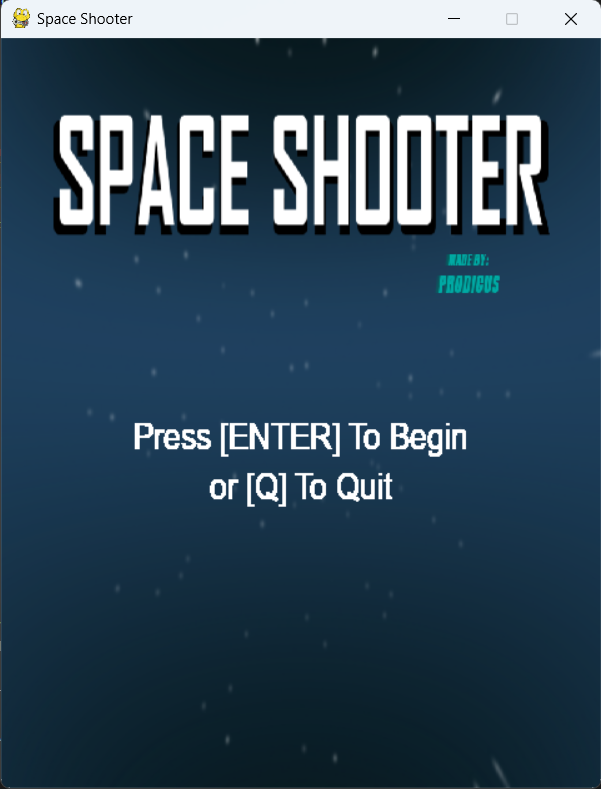

# Space Shooter Game

## Details
A classic space shooter game made with the pygame library. Dive into an exciting space combat experience, dodge meteors, and face powerful enemies.

### Modules Needed
- pygame
- random
- os

To install pygame, use the following pip command: pip install pygame

### Features
1. Immersive space shooting experience.
2. Variety of enemies to tackle.
3. Collect power-ups to enhance your spaceship's capabilities.
4. Score tracking and shield status bar.
5. Rotating meteors for an added challenge.
6. Smooth gameplay with synced FPS.

### Getting Started
1. Clone this repository: git clone https://github.com/Bisalkumar/Spaceshooter_Game.git
2. Navigate to the directory: cd SpaceShooter_Game
3. Run the game script: python game.py

### How to Use
1. Use arrow keys (left and right) to move the spaceship.
2. Press the spacebar to shoot bullets.
3. Dodge incoming meteors and enemies.
4. Collect power-ups to get additional capabilities.

### Screenshots

### Contributions
Contributions are welcome! Please read the CONTRIBUTING.md file for more details on how to contribute to this project.

### License
This project is licensed under the MIT License - see the LICENSE.md file for details.

### Acknowledgement
Special thanks to pygame for their comprehensive game development library.
Appreciation to all contributors and testers for making this game better.